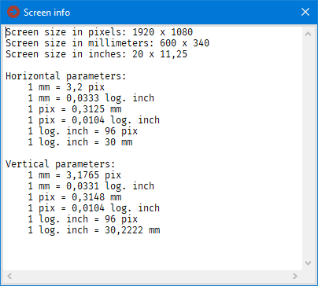

# PixelConv

## About

PixelConv is a small program that allows you to convert screen sizes between three units: pixels, millimeters and logical inches.

I wrote this program for my own use, but maybe it will be useful for someone else.  
Sometimes I have to convert pixels to millimeters (and vice versa), then I use PixelConv.

The PixelConv can also be considered as a demonstration application of my [JPL.PixelConv.pas](https://github.com/jackdp/JPLib/blob/master/Graphics/JPL.PixelConv.pas) unit.

## Download

[PixelConv.zip](PixelConv.zip) (32 & 64-bit version)

## License

Public domain

## Compilation

You need:

1. Delphi environment. The free [community version](https://www.embarcadero.com/products/delphi/starter/free-download) is enough.
1. JPLib: <https://github.com/jackdp/JPLib>
1. JPPack: <https://github.com/jackdp/JPPack>
1. JVCL: <https://github.com/project-jedi/jvcl>
1. JPJVCL: <https://github.com/jackdp/JPModLib#jpjvcl>

## Screenshots

### Pixels

### Millimeters

### Logical inches

### Screen info

